# URL Shortener

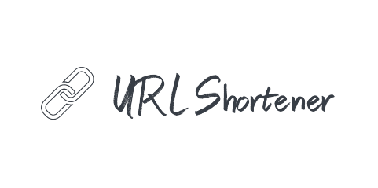

<h2>Table of Contents</h2>
<ul>
  <li><a href="#built-with--">Built With</a></li>
  <li><a href="#getting-started">Getting Started</a></li>
  <li><a href="#Description">Description</a></li>
  <li><a href="#Documentation">Documentation</a></li>
  <li><a href="#Screenshots">Screenshots</a></li>
</ul>

<h2 href="#BuiltWith">Built With : </h2>
 <ul>
  <li><a href="https://www.w3schools.com/nodejs/">Node js</a></li>
  <li><a href="https://www.javatpoint.com/expressjs-tutorial">Express js</a></li>
  <li><a href="https://www.w3schools.in/mongodb/tutorials/">MongoDB</a></li>
  <li><a href="https://www.w3schools.com/REACT/DEFAULT.ASP">React js</a></li>
 </ul>

<h2 href="#GettingStarted">Getting Started</h2>
<blockquote>
  
This is a list of needed instructions to set up your project locally, to get a local copy up and running follow these instructions.
 

</blockquote>
<ol>
<li>
  <h4>Clone the repository.</h4>
 </li>
 <li>
  <h4>cd into backend folder and create a file named "config.env" and fill it with this fields with your information like <code>./backend/example.env</code> </h4>
 </li>
 <li>
  <h4>Follow this article to install node js and npm <a href="https://phoenixnap.com/kb/install-node-js-npm-on-windows">Install Node js and npm</a></h4>
 </li>
 <li>
  <h4><code>cd backend && npm i && npm start</code></h4>
 </li>
 <li>
  <h4><code>cd .. && cd frontend && npm i && npm start</code></h4>
 </li>
 </ol>

<h2 href="#Description">Description</h2>
  

  This is a MERN project that shortens URLs, this a task to join Appgain.io backend development internship.
  
  
 The user enters the landing page through https://localhost:3000/ , then he enters URL, Slug (optional), iOS primary and fallback URLs, Android primary and fallback URLs, then he receives a shortened link.
  
 If he clicks on it, he receives a link according to his device Desktop, iOS, or Android.
  
  
 He also can update the attributes of the shortened URL, and he can list all shortened URLs information in a table.
 
  
 Used Node.js, Express.js, MongoDB (and MLab for deployment) for backend part, and React.js for frontend part. 
 

<h2 href="#Documentation">Documentation</h2>
  

  You can look on the API documentation at <a href="https://documenter.getpostman.com/view/22736405/2s93sXdv3C">API Documentation</a>
   
  Or through running postman collection stored in <code>./documentation/URLShortener.json</code>
  

<h2 href="#Screenshots">Screenshots</h2>
<ol>
    <li>
    <h3>Form to create a new short URL (slug is optional).</h3>
    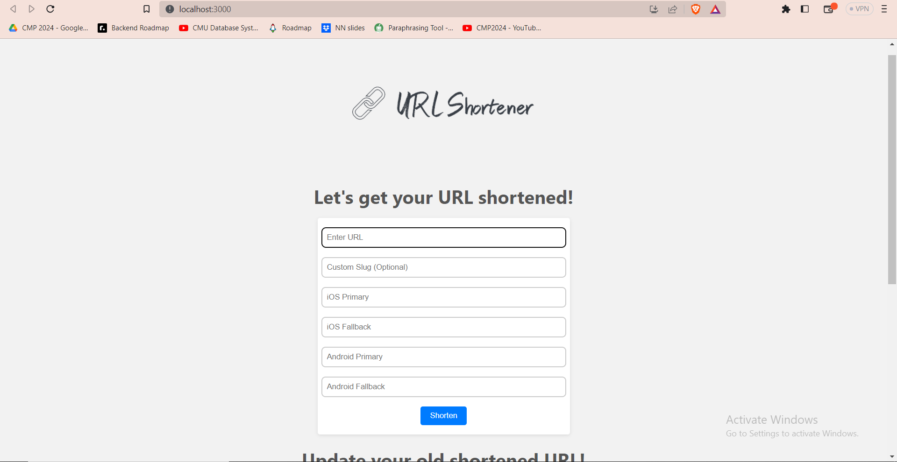
    </li>
    <li>
    <h3>Form to create a new short URL (slug is optional) 2.</h3>
    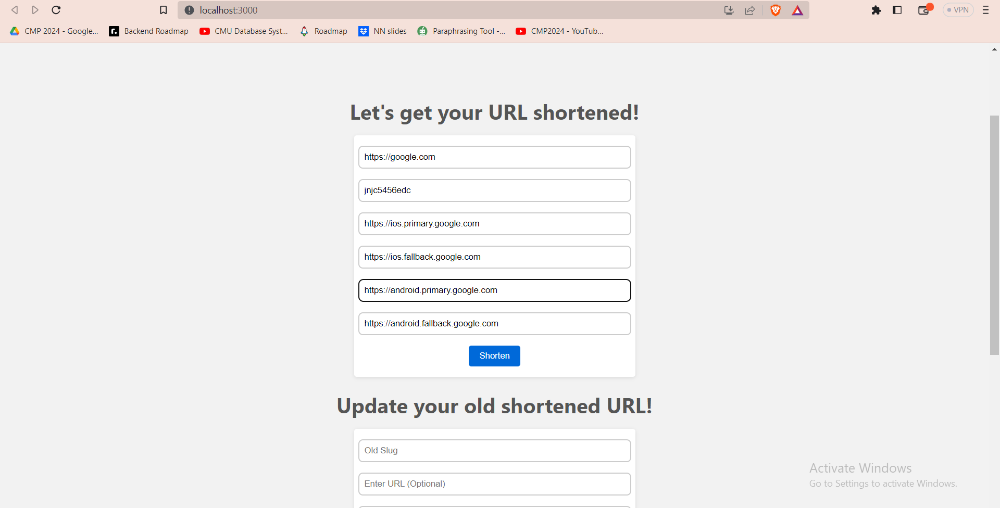
    </li>
    <li>
    <h3>Recent short link is shown after creating.</h3>
    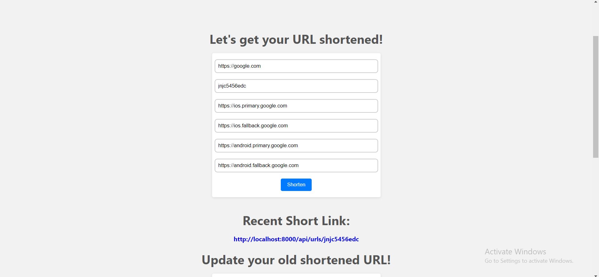
    </li>
    <li>
    <h3>Receiving a link for my device (Desktop) after clicking on the link (there is a link for iOS, and another for Android if detected any of them)</h3>
    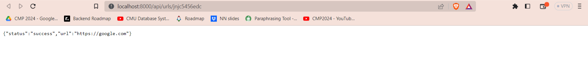
    </li>
    <li>
    <h3>Error when trying to create a new URL with old slug.</h3>
    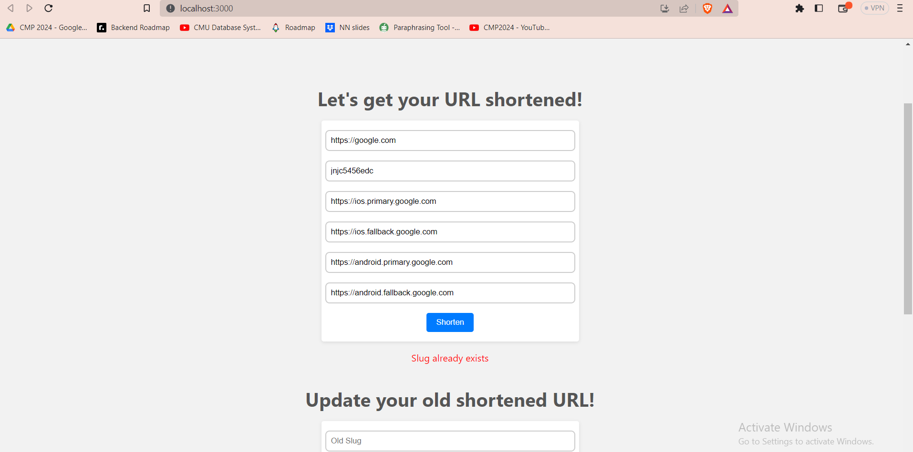
    </li>
    <li>
    <h3>Creating a new URL without submitting a slug.</h3>
    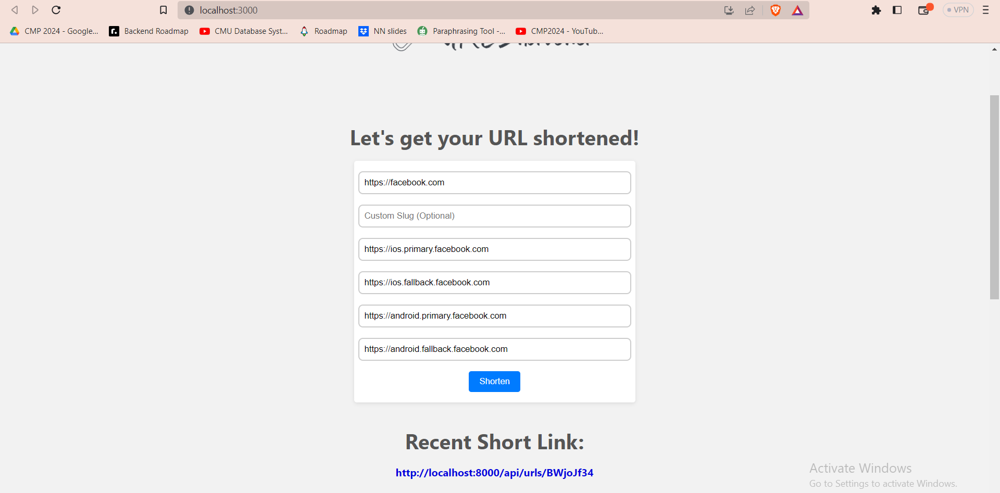
    </li>
    <li>
    <h3>Updating desktop (web) link of an URL.</h3>
    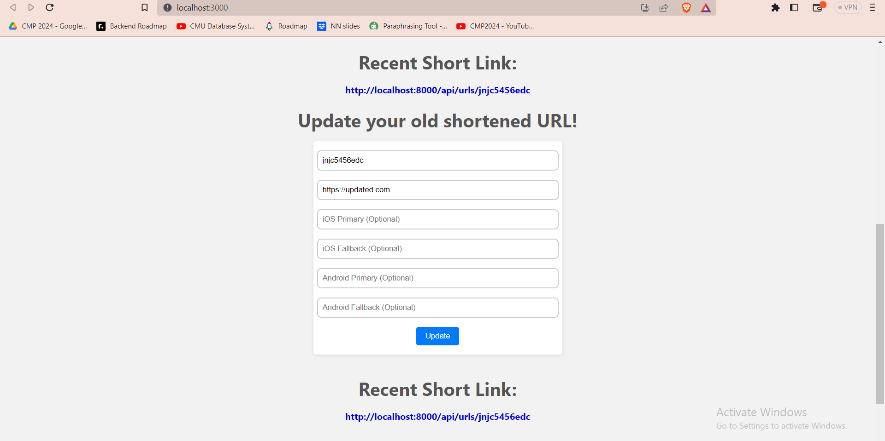
    </li>
    <li>
    <h3>Showing all created URLs in table after clicking on "Show Short Links".</h3>
    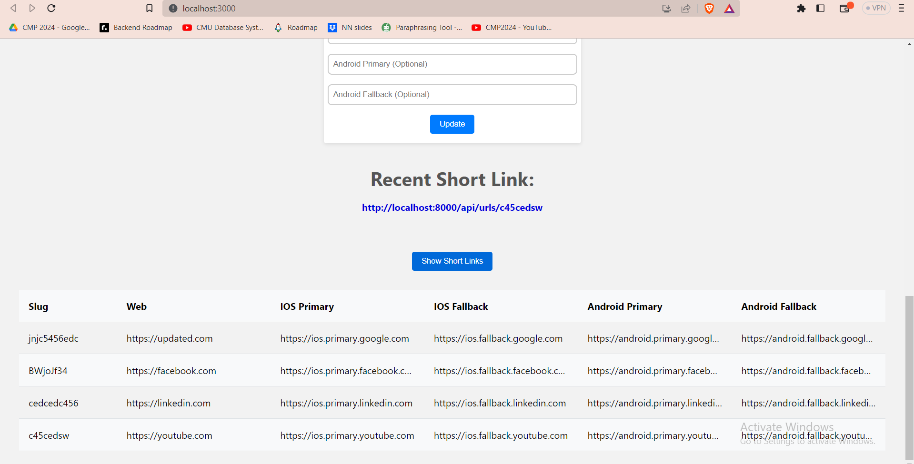
    </li>
    <li>
    <h3>Expanding columns when hovering on them.</h3>
    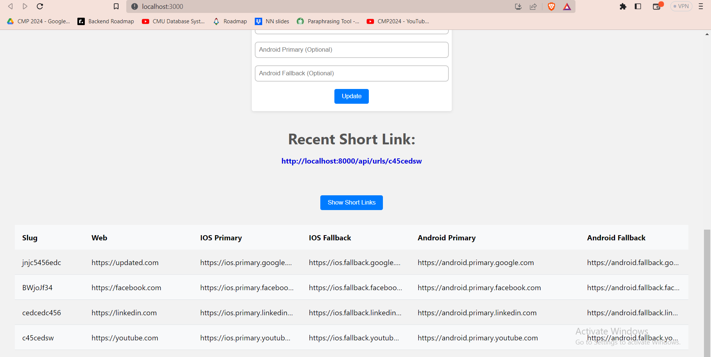
    </li>
    <li>
    <h3>Responsive Design.</h3>
    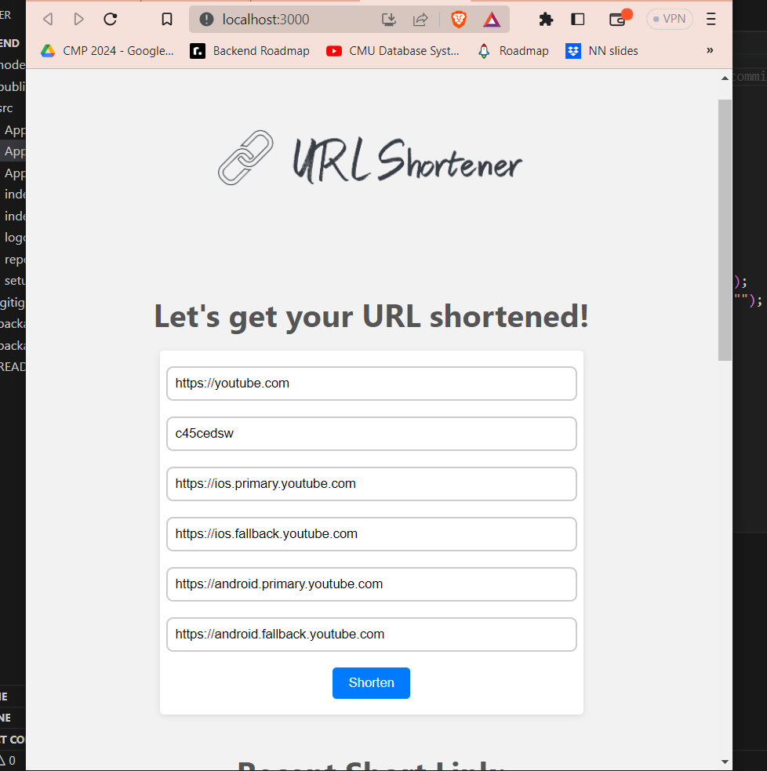
    </li>
</ol>
